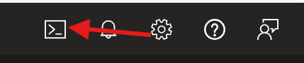
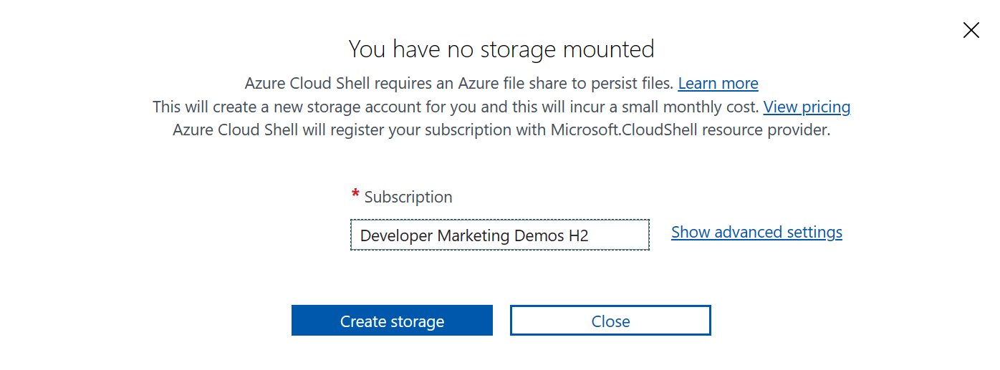
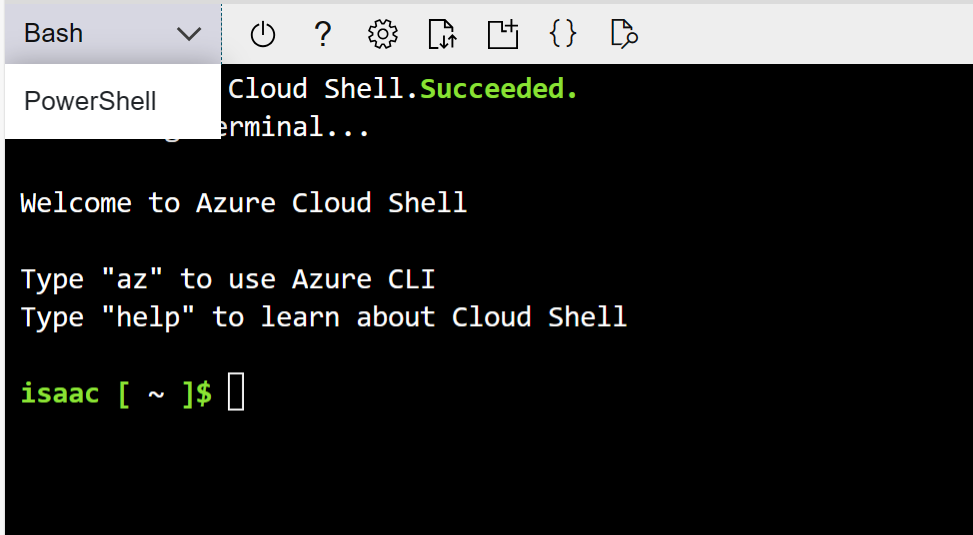
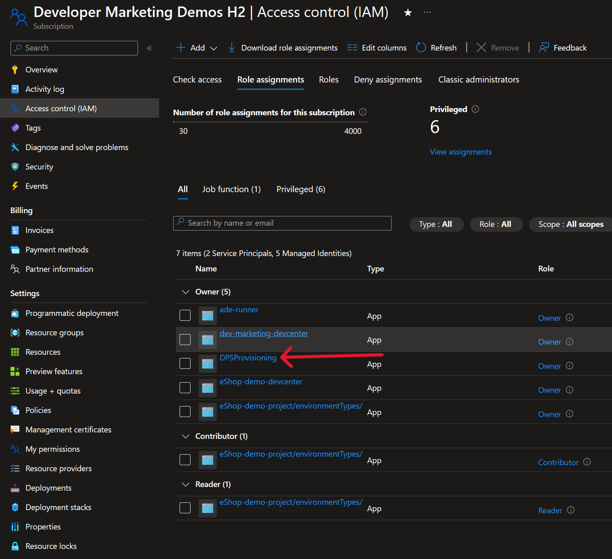
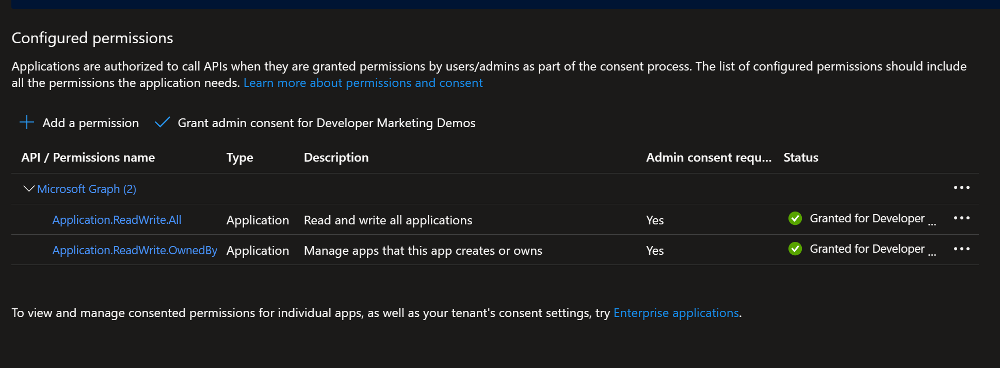

# Create Service Principal for Demo Generation Tool

The demo generation tool relies on creating Entra ID App Registrations as well as Service Principals using the Azure CLI. In order to do this without requiring a login, we will need to create a service principal. For more information on creating service principals, take a look at the [documentation on Microsoft Learn](https://learn.microsoft.com/en-us/cli/azure/azure-cli-sp-tutorial-1).

## Open Cloud Shell in the Azure Portal

You can create a service principal anywhere the Azure CLI is installed, the fastest way is to use the [Azure Cloud Shell](https://learn.microsoft.com/en-us/azure/cloud-shell/overview). You can also do this with the Azure CLI on any computer you have it installed. You will need to login to the tenant where you want the Developer Productivity Services resources installed.

### 1. To access Azure Cloud Shell, login to the Azure Portal and click the icon in the top left of the browser



### 2. This will open a pane in the browser for Cloud Shell, if this is the first time you are using Cloud Shell, you will be asked to create a storage account to persist files.



### 3. After you click `Create Storage`, a new resource group will be created that contains a storage account that holds the necessary files for Cloud Shell. Once that is completed, the pane will update with an interactive CLI where you can choose Bash or PowerShell. For the script below use PowerShell



### 4. The next steps are to run the Azure CLI commands to do the following

- Create a new Service Principal with the `Owner` role on the subscription you want to create the resources in
- Adds Microsoft Graph Permissions `Application.ReadWrite.All` and `Application.ReadWrite.Owned` to the service principal. This gives the service principal the appropriate rights to create future app registations and service principals in the future.
- Grants the added permissions to the service principal

You will need to replace the value of `subscriptionID` with the ID of your Azure subscription

```powershell
# Create Service Principal, you will need to save the "appId", "password" and "tenant" values for later.
az ad sp create-for-rbac --name DPSProvisioning --role owner --scopes /subscriptions/{subscriptionID}

#Microsoft Graph API ID: 00000003-0000-0000-c000-000000000000
#Application.ReadWrite.All Permission ID: 1bfefb4e-e0b5-418b-a88f-73c46d2cc8e9
#Application.ReadWrite.Owned Permission ID: 18a4783c-866b-4cc7-a460-3d5e5662c884

# Add Application.ReadWrite.All and Application.ReadWrite.Owned permissions from the Graph API
# to the Service Principals
az ad app permission add --id {appId} --api 00000003-0000-0000-c000-000000000000 --api-permissions 1bfefb4e-e0b5-418b-a88f-73c46d2cc8e9=Role 18a4783c-866b-4cc7-a460-3d5e5662c884=Role

# Grants Application.ReadWrite.All and Application.ReadWrite.Owned permissions from the Graph API
# to the Service Principals
az ad app permission grant --id {appId} --api 00000003-0000-0000-c000-000000000000 --scope Application.ReadWrite.All Application.ReadWrite.Owned
```

### 5. Once the above commands are run, you will need to grant these permissions via the Azure Portal. To do that, navigate to https://portal.azure.com/#view/Microsoft_AAD_IAM/ActiveDirectoryMenuBlade/~/RegisteredApps and select the service principal you created



### 6. Next navigate to `API Permissions`, where you will see a page with configured permissions on it with a checkbox stating to grant admin content for the subscription.



### 7. Confirm the consent and now you have a created service principal that the demo generation ool will use to create additional app registrations and service principals.

### 8. Remember to store the values of `appId`, `password` and `tenant` from the service principal as they will be used later on.