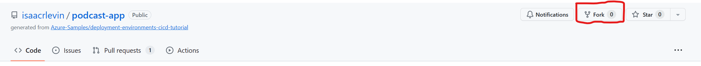
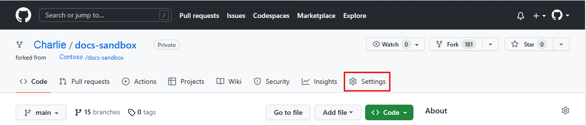
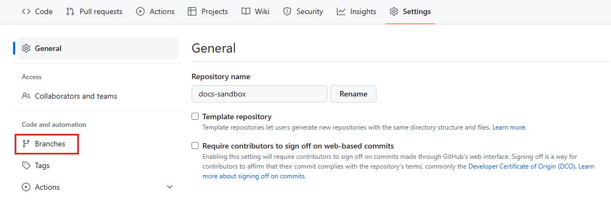
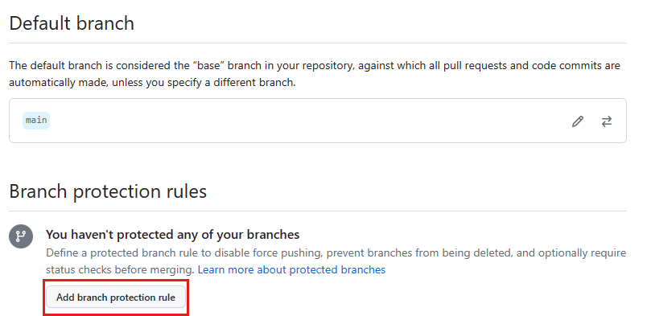
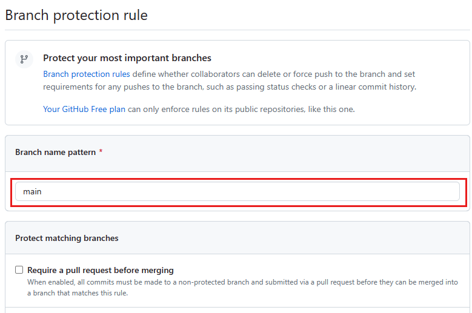
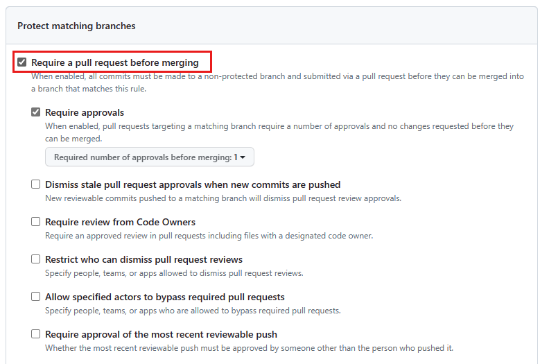
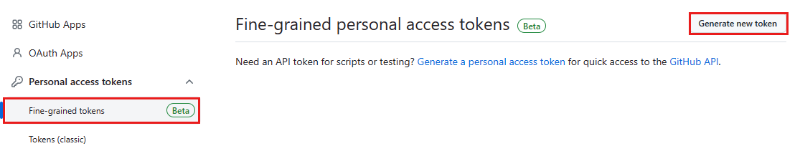
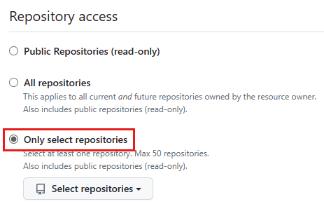

## Create and configure a GitHub repository

> [!NOTE]
> Sections below taken from Learn documentation titled [Tutorial: Deploy environments in CI/CD with GitHub](https://learn.microsoft.com/en-us/azure/deployment-environments/tutorial-deploy-environments-in-cicd-github)

In this section, you create a new GitHub repository to store a catalog. Azure Deployment Environments supports both GitHub and Azure DevOps repositories. In this tutorial, you use GitHub.

### Fork GitHub Repo

In this step, you will fork an existing GitHub repository that is setup with Azure Deployment Environments configured on it.

1. From GitHub.com, navigate to the [sample repo](https://github.com/dotnet/eShop) and click the fork button.

2. Clone newly forked repo in your local environment.

### Protect the repository's *main* branch

You can protect important branches by setting branch protection rules. Protection rules define whether collaborators can delete or force push to the branch. They also set requirements for any pushes to the branch, such as passing status checks or a linear commit history.

> [!NOTE]
> Protected branches are available in public repositories with GitHub Free and GitHub Free for organizations, and in public and private repositories with GitHub Pro, GitHub Team, GitHub Enterprise Cloud, and GitHub Enterprise Server. For more information, see "[GitHub’s products](https://docs.github.com/en/get-started/learning-about-github/githubs-products)".

1. If it's not already open, navigate to the main page of your repository.

1. Under your repository name, select **Settings**. If you can't see the "Settings" tab, select the **...** dropdown menu, then select **Settings**.

1. In the **Code and automation** section of the sidebar, select **Branches**.

2. Under **Branch protection rules**, select **Add branch protection rule**.

3. Under **Branch name pattern**, enter <*main*>.

4. Under **Protect matching branches**, select **Require a pull request before merging**.

5. Optionally, you can enable [more protection rules](https://docs.github.com/en/repositories/configuring-branches-and-merges-in-your-repository/defining-the-mergeability-of-pull-requests/managing-a-branch-protection-rule#creating-a-branch-protection-rule).

6. Select **Create**.

### 2.3 Create a GitHub personal access token

Next, create a [fine-grained personal access token](https://docs.github.com/en/authentication/keeping-your-account-and-data-secure/creating-a-personal-access-token#fine-grained-personal-access-tokens) to enable your dev center to connect to your repository and consume the environment catalog.

> [!NOTE]
> Fine-grained personal access token are currently in beta and subject to change. To leave feedback, see the [feedback discussion](https://github.com/community/community/discussions/36441).

1. In the upper-right corner of any page on GitHub.com, select your profile photo, then select **Settings**.

1. In the left sidebar, select **Developer settings**.

1. In the left sidebar, under **Personal access tokens**, select **Fine-grained tokens**, and then select **Generate new token**.

1. On the New fine-grained personal access token page, under **Token name**, enter a name for the token.

1. Under **Expiration**, select an expiration for the token.

1. Select your GitHub user under **Resource owner**.

1. Under **Repository access**, select **Only select repositories** then in the **Selected repositories** dropdown, search and select the repository you created.

1. Under **Permissions**, select **Repository permissions**, and add the following permissions
   - **Administration** to **Read and write**
   - **Contents** to **Read and write**.
   - **Deployments** to **Read and write**.
   - **Environments** to **Read and write**.
   - **Secrets** to **Read and write**.
   - **Variables** to **Read and write**.

1. Select **Generate token**.

2. Copy your personal access token now and save it for later. We will use it as part of the environment provisioning setup. You cannot view it again.